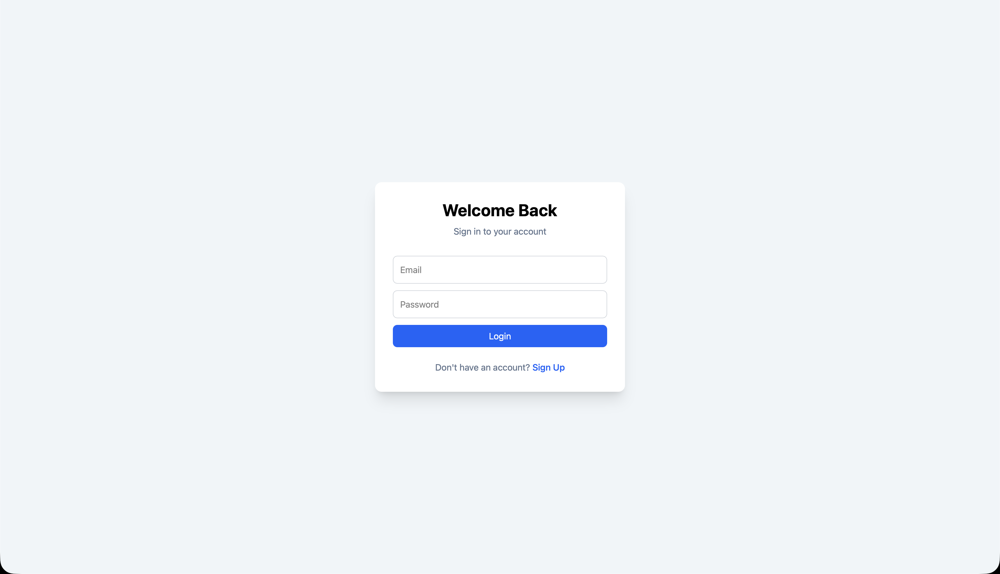
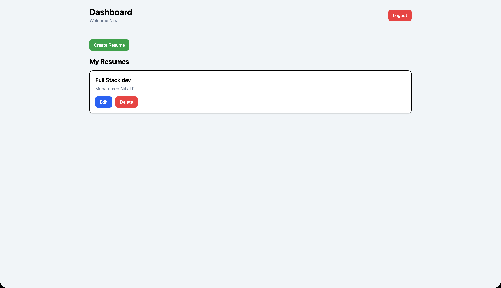
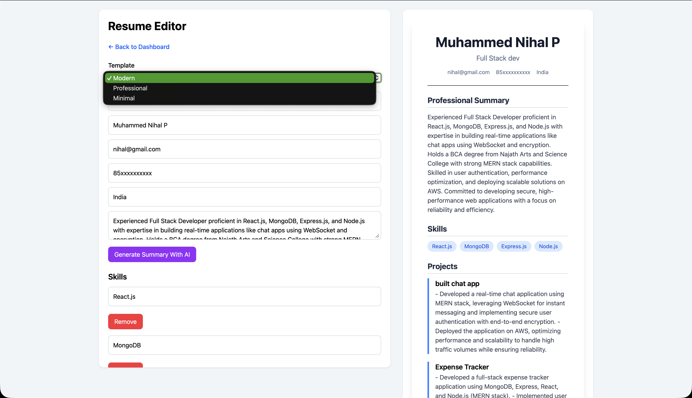
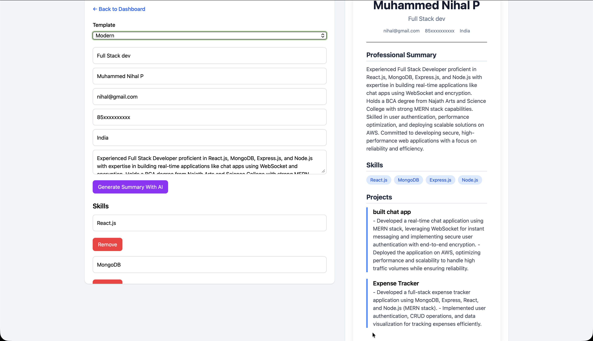
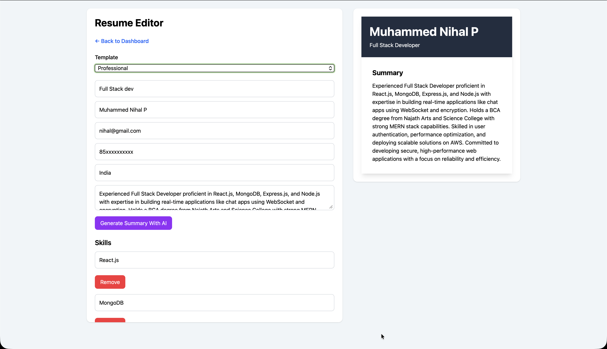

# AI Resume Builder

An AI-powered Resume Builder built using the MERN Stack. Users can create, edit, manage, and export professional resumes while leveraging AI to generate professional summaries and improve project descriptions.

## Live Demo

Frontend: https://ai-resume-builder-zeta-roan.vercel.app/

Backend: https://ai-resume-builder-3h98.onrender.com

## Features

### Authentication

* User Registration
* User Login
* JWT Authentication
* Protected Routes

### Resume Management

* Create Resume
* Edit Resume
* Delete Resume
* Persistent Resume Storage

### AI Features

* AI Professional Summary Generation
* AI Project Description Enhancement
* OpenRouter AI Integration

### Resume Templates

* Modern Template
* Professional Template
* Minimal Template
* Template Persistence

### Resume Preview

* Real-Time Preview
* Responsive Design
* Dynamic Section Rendering

### Export

* PDF Resume Export

### User Experience

* Toast Notifications
* Loading States
* Responsive UI
* Dashboard Management

## Screenshots

### Login Page



### Dashboard



### Resume Editor



### Modern Template



### Professional Template



## Tech Stack

### Frontend

* React.js
* React Router DOM
* Tailwind CSS
* Axios
* React Hot Toast

### Backend

* Node.js
* Express.js
* MongoDB
* Mongoose
* JWT Authentication
* Bcrypt.js

### AI Integration

* OpenRouter AI
* DeepSeek Chat Model

### Deployment

* Vercel
* Render
* MongoDB Atlas

## Project Structure

```text
AI-Resume-Builder
│
├── frontend
│   ├── src
│   │   ├── api
│   │   ├── components
│   │   ├── context
│   │   ├── pages
│   │   ├── templates
│   │   └── utils
│
├── backend
│   ├── config
│   ├── controllers
│   ├── middleware
│   ├── models
│   ├── routes
│   ├── services
│   └── server.js
│
├── screenshots
│
└── README.md
```

## Installation

### Clone Repository

```bash
git clone YOUR_GITHUB_REPOSITORY_URL
cd AI-Resume-Builder
```

### Backend Setup

```bash
cd backend

npm install

npm run dev
```

Create a `.env` file:

```env
PORT=8000

MONGO_URI=YOUR_MONGODB_URI

JWT_SECRET=YOUR_JWT_SECRET

OPENROUTER_API_KEY=YOUR_OPENROUTER_API_KEY
```

### Frontend Setup

```bash
cd frontend

npm install

npm run dev
```

Create a `.env` file:

```env
VITE_API_URL=your_url
```

## API Endpoints

### Authentication

```text
POST /api/auth/register
POST /api/auth/login
```

### Resumes

```text
GET    /api/resumes
POST   /api/resumes
GET    /api/resumes/:id
PUT    /api/resumes/:id
DELETE /api/resumes/:id
```

### AI

```text
POST /api/ai/generate-summary
POST /api/ai/improve-description
```

## Future Improvements

* Cover Letter Generator
* ATS Resume Score Checker
* Resume Sharing
* Multiple Export Formats
* Resume Analytics
* Custom Theme Builder

## Author

### Muhammed Nihal P

GitHub: https://github.com/nihal514t

LinkedIn: https://www.linkedin.com/in/nihal514t/

Email: [nihal514t@gmail.com](mailto:nihal514t@gmail.com)

## License

This project is licensed under the MIT License.
